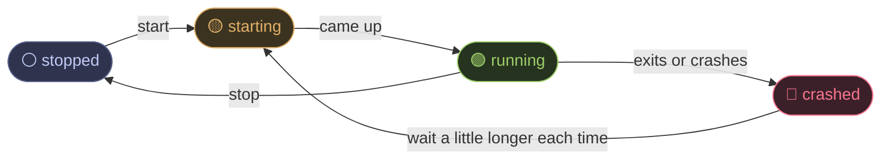
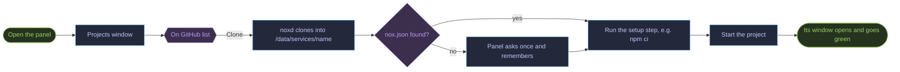

<p align="center">
  
</p>

<p align="center">
  
  
  
  
  
  
  
</p>

<h3 align="center">
  A hand-built, extremely small Linux that turns an old x86 laptop into a home server,<br>
  with a vivid, terminal-style control panel you open in your browser.
</h3>

<br>

> **🚧 Status: planning.** Nothing is built yet. The pictures on this page are **design mockups** of what nox is meant to become, with made-up example data. **[PLAN.md](PLAN.md)** is the step-by-step route to get there.

<br>

## ✨ What is nox?

An old laptop is a perfectly good always-on computer, if it only runs what it needs to. **nox** is a Linux built from the ground up to do exactly one job: **run my projects side by side and show me how they're doing.**

No desktop, no package manager, no background services I didn't choose. It boots into a tiny system, starts every project, restarts the ones that crash, and serves a colourful panel that I open from my PC or phone.

**Why it exists:** the [Rental Watch](https://github.com/Kilo27/find-rentals) laptop agent has to fetch pages from an ordinary home connection, because Daft.ie and Rent.ie refuse cloud servers. A little box at home solves that, and once it's there it can also host a Minecraft server and anything else I build.

| | |
|---|---|
| 💻 **Hardware** | one old 64-bit x86 laptop, wired Ethernet to start with |
| 🧠 **Brain** | a trimmed Linux kernel + BusyBox + **`noxd`**, my own service runner |
| 🏃 **Runs** | the Rental Watch laptop agent, a Minecraft server, whatever comes next, all at once |
| 🖥️ **Panel** | tiling windows that never overlap, terminal themes, live status and logs |
| 🐙 **Getting projects on** | clone them from GitHub with one click in the panel |
| 🔌 **Day to day** | never touch the laptop again: the panel and SSH do everything |
| ✍️ **Hand-coded** | `/init`, `noxd`, the panel and the build scripts |

<br>

## 🧱 The stack

<p align="center">
  
</p>

A "distro" this small is **someone else's kernel and BusyBox plus my own glue**. The glue is where the learning is.

| Layer | Who | What it does |
|---|---|---|
| 🎨 **The panel** | ✍️ me | HTML, CSS and JS, packed inside `noxd`. Shown in a browser on another device |
| 📦 **Projects** | ✍️ me | Each lives in its own folder with its own runtime (Node, Java, Python…) |
| ⚙️ **`noxd`** | ✍️ me | Starts projects, restarts them, caps their memory, writes their logs and serves the panel. One self-contained Go program |
| 🚀 **`/init`** | ✍️ me | The first program at boot: mounts disks, brings up the network and clock, starts `noxd` |
| 🧰 **BusyBox, dropbear, musl** | 📦 borrowed | Basic commands, an SSH server and the C library, a few MB in all |
| 🐧 **Linux kernel** | 📦 borrowed | Trimmed to this laptop. I only choose the options |

<br>

## ⏻ From power button to panel

<p align="center">
  
</p>

<br>

## 💾 Where things live

<p align="center">
  
</p>

The OS is **one file** that loads into RAM, and everything I care about lives on a **separate `/data` partition**. That gives three nice properties for free:

- 🔄 **Updating** the OS means replacing one file and rebooting.
- ⏪ **Rolling back** means keeping the old file.
- ⚡ **A power cut can't damage the OS**, and `/data` is checked on every boot.

<br>

## 🖥️ The panel

<p align="center">
  
</p>

<p align="center"><sub>Design mockup with example data. Everything shown is planned, not built.</sub></p>

Extremely trimmed down: a thin strip for the laptop's health (CPU, memory, disk, temperature, uptime), then windows. Nothing else.

### 🪟 Windows that behave

<p align="center">
  
</p>

The screen is split into regions and every window is exactly one region. That's a **tiling layout**, like i3 or tmux, and it's why windows can never overlap and always snap into place.

- ↔️ **Drag the divider** between two windows to resize both.
- 🧲 **Drag a title bar** onto the edge of another window to dock it there.
- 🧩 **Layout buttons:** stack, side by side, 2×2, or one big window plus a side strip.
- 📌 **The Projects window is always open.** Move it, resize it, never close it.
- 🙈 **Closing a window only hides it.** The project keeps running.
- 📱 **One layout everywhere:** it's saved on the laptop, and phones get a single column.

### 🎨 Terminal themes

<p align="center">
  
</p>

Dark, monospace, saturated colour on near-black. A theme is only about ten colours, so adding my own is one small block. Motion is lively but never busy: pulsing status dots, windows that glide when resized, graphs that tick live, log lines that slide in. It all switches off for anyone who asks their device for reduced motion.

### 🚦 Status colours

Colours always mean the same thing, in every theme:

| | State | Meaning |
|---|---|---|
| 🟢 | **running** | Up and healthy |
| 🟡 | **starting** | Coming up, or being set up |
| 🔴 | **crashed** | Exited unexpectedly. `noxd` retries by itself |
| ⚪ | **stopped** | Switched off on purpose |



### 🧩 What's in a project window

| | |
|---|---|
| 📊 **Status** | Running / starting / crashed / stopped, uptime, memory and CPU as small live graphs |
| 📜 **Live log** | Scrolls as lines arrive |
| ▶️ **Controls** | Start, stop, restart |
| 🔁 **Start at boot** | On or off per project |
| 🧮 **Memory limit** | So a hungry Minecraft can't starve the rental agent |
| ⚙️ **Settings** | Environment variables, with secrets hidden |
| ⇣ **Update** | Pull from GitHub, run the setup step, restart |
| 🗑️ **Remove** | Take the project off the laptop |

<br>

## 🐙 GitHub integration

Installing a project should be a click, not an `scp` session.



1. **Sign in once** by pasting a fine-grained access token (read-only on my repos). It is stored on `/data`, readable only by `noxd`, and **never sent to the browser**. "Sign in with GitHub" (device login) can come later.
2. The Projects window lists my repos under **On GitHub**, searchable. **Clone** puts one in `/data/services/<name>`. `noxd` clones by itself, so the laptop doesn't need `git` installed.
3. `noxd` needs to know how to start it, so it looks for a tiny **`nox.json`** in the repo. If there isn't one, the panel asks once and remembers. For the rental agent:

   ```json
   { "runtime": "node", "setup": "npm ci --omit=dev", "run": "node --env-file-if-exists=.env src/agent-main.js" }
   ```

4. Secrets such as `AGENT_TOKEN` live in the project's settings on `/data`, never in the repo.
5. **Update** on a project window pulls, sets up again and restarts.

<br>

## 🔐 Safety

- 🔑 **One password** to log in (stored hashed). The panel can start programs and clone code onto the box, so treat it like SSH.
- 🏠 **LAN only.** Never exposed to the internet. The only port I might ever open is Minecraft's, if I choose to share it.
- 🗝️ **SSH is key-only.**
- 🤫 **Tokens** (GitHub, the agent) live on `/data`, locked to the right user, and are never in git or the browser.
- 🛟 **If the network is down,** SSH and the `svc` command line still work.

<br>

## 🧭 Roadmap

<p align="center">
  
</p>

Every phase ends with a check I can actually perform, so I always know where I am. The full detail is in **[PLAN.md](PLAN.md)**.

- [x] **Plan written**
- [ ] **0 · Prep.** WSL2 + QEMU on the PC; hardware notes from a live USB. ✅ *Done when:* `docs/laptop.md` exists
- [ ] **1 · Boot to a prompt in QEMU.** Kernel + BusyBox + a tiny `/init`. ✅ *Done when:* QEMU shows my own "hello from nox"
- [ ] **2 · A real init.** Hostname, logging, DHCP, NTP clock. ✅ *Done when:* `wget https://example.com` works in QEMU
- [ ] **3 · Boot on the real laptop.** Boot + `/data` partitions, kernel trimmed to the hardware. ✅ *Done when:* it reaches nox with no USB attached
- [ ] **4 · Remote access.** dropbear SSH, Ethernet, fixed address. ✅ *Done when:* `ssh nox` works and I can reboot it remotely
- [ ] **5 · `noxd`, the service runner.** Start, restart on crash, logs, memory caps, `svc` command. ✅ *Done when:* two toy services run at once and one can be killed without the other noticing
- [ ] **6 · First real project: the rental agent.** Node runtime + a `deploy` script. ✅ *Done when:* Railway logs show `via-laptop=daft,rent`
- [ ] **7 · The panel's engine and a plain page.** Login, live status and logs over HTTP. ✅ *Done when:* I stop the agent from my browser and watch it flip within a second
- [ ] **8 · The look.** Tiling engine, project windows, themes, motion, phone layout. ✅ *Done when:* three windows resize, re-dock and survive a reload
- [ ] **9 · GitHub clone.** Token, repo list, clone, `nox.json`, update. ✅ *Done when:* I clone, configure and start a repo without touching SSH
- [ ] **10 · Minecraft and the rest.** Java runtime, memory cap, console. ✅ *Done when:* agent and Minecraft run together for 24 hours untouched
- [ ] **11 · Make it boring.** Backups, power-cut recovery, one-command rebuild. ✅ *Done when:* I can rebuild the whole OS image with one `make`

> 🏁 **Milestone:** the rental agent runs on the laptop after phase 6, before any UI exists.

<br>

## 🧰 Decisions at a glance

| Question | Choice | Why |
|---|---|---|
| From scratch, Buildroot or Alpine? | **From scratch: kernel + BusyBox** | The most hand-coding and the least magic. Buildroot is the fallback |
| libc | **musl** | Small, and Node and Java both ship musl builds |
| Where does the OS live? | **In RAM, loaded from a small boot partition**, data on `/data` | Easy updates and rollbacks, safe from power cuts |
| Containers? | **No.** Plain processes, one user per project | Docker is big. Each project brings its own runtime |
| Where does the UI show? | **In a browser on my PC or phone** | The laptop needs no graphics stack, so the OS stays tiny |
| `noxd` language | **Go** | One static file, builds on Windows, a Go library can clone from GitHub |
| UI tech | **Plain HTML, CSS, JS. No framework, no build step** | Easy to hand-code, and it packs into `noxd` |
| Window behaviour | **Tiling layout** | Windows can't overlap and always snap |
| GitHub sign-in | **Fine-grained token first** | Much less code and tight permissions |

<br>

## ⚠️ Risks to keep in mind

- 📶 **Wi-Fi is the biggest unknown.** It needs firmware files and `wpa_supplicant`. Ethernet comes first.
- 🧠 **Old laptop RAM.** Minecraft is the hungry one and it limits how many projects fit. The panel itself is small.
- 🎭 **UI polish can swallow weeks.** Phase 7's plain page is already useful. No animations until the tiling windows work.
- 🧱 **The tiling layout is the trickiest front-end part.** Keep it simple: splits with a ratio, never free-floating boxes.
- 📚 **Shared libraries.** Node on musl needs a few extra library files copied in. "File not found" for a program that clearly exists usually means a missing library.
- 🔋 **Always-on laptop.** Check the battery isn't swollen before leaving it plugged in.

<br>

## 📁 Planned repo layout

```
linux-nox/
├── PLAN.md
├── README.md
├── build/      scripts that fetch and build the kernel, BusyBox, dropbear and assemble the image
├── config/     kernel and BusyBox settings (the .config files)
├── rootfs/     files that go inside the OS: /init and /etc            <- hand-written
├── noxd/       the service runner + panel server (Go)                 <- hand-written
│   └── web/    the panel's HTML, CSS and JS, packed into noxd
├── services/   example nox.json files for my projects
├── tools/      run-in-qemu, make-usb, deploy
└── docs/       laptop.md, notes and the images used by this README
```

<br>

## 🔮 Later, if I want it

- 🖼️ Show the panel on the laptop's own screen (needs a graphics stack and a tiny browser)
- 🔓 "Sign in with GitHub" (device login) instead of pasting a token
- 📥 Install runtimes (Node, Java) from the panel
- 🔔 Alerts to my phone when a project crashes
- 🤖 Auto-update: the laptop checks GitHub and updates a project itself
- 🧱 Proper isolation between servers (namespaces, or containers)
- 🌍 Reach the panel from outside the house through a tunnel such as Tailscale
- 📡 Wi-Fi support

<br>

## 🚀 Where to start

Phase 0, in about an evening:

1. Install **WSL2** and **QEMU** on the PC (and Go, if `noxd` is going to be Go).
2. Boot any normal Linux **live USB** on the laptop and write down: 64-bit or 32-bit CPU, RAM, BIOS or UEFI, Ethernet port, Wi-Fi chip. *Node 22 and modern Java are 64-bit only.*
3. Check the battery, and set the BIOS to **power on after power loss**.
4. Save the notes in `docs/laptop.md`.

<br>

## 🙏 Standing on shoulders

nox borrows the [Linux kernel](https://kernel.org), [BusyBox](https://busybox.net), [musl](https://musl.libc.org), [dropbear](https://matt.ucc.asn.au/dropbear/dropbear.html) and [Go](https://go.dev), and runs projects on [Node.js](https://nodejs.org) and Java. The panel's terminal themes are inspired by the classic colour schemes Tokyo Night, Dracula, Gruvbox, Nord, Catppuccin and Solarized.

<p align="center">
  <br>
  <sub>The pictures in <code>docs/img</code> are plain SVG: edit them in any text editor.</sub>
</p>
